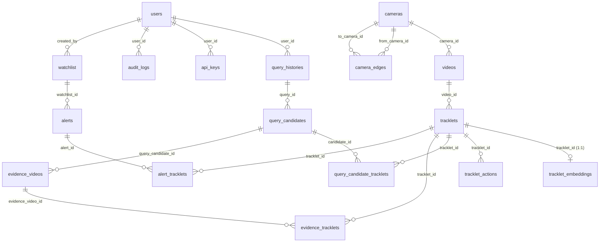

# BÁO CÁO AUDIT TOÀN DIỆN: TraceX-AI

**Ngày audit:** 2026-05-11 (cập nhật fixes: 2026-05-11)
**Auditor:** Senior Backend + ML Systems Auditor
**Schema version:** v3.3 (VLM pipeline)
**Tổng file Python:** 61
**Audit dựa trên:** source code thực tế + git history + docker-compose

---

## MỤC LỤC

1. [Database Overview](#phần-1--database-overview)
2. [ERD Toàn Bộ Database](#phần-2--erd-toàn-bộ-database)
3. [Tracklets Table Chi Tiết](#phần-3--tracklets-table-chi-tiết)
4. [Embedding Tables và Vector Fields](#phần-4--embedding-tables-và-vector-fields)
5. [Action Table](#phần-5--action-table)
6. [Model Inventory và Model → DB Column Mapping](#phần-6--model-inventory-và-model--db-column-mapping)
7. [Import Video Flow End-to-End](#phần-7--import-video-flow-end-to-end)
8. [Video_Process Pipeline Hiện Tại](#phần-8--video_process-pipeline-hiện-tại)
9. [Query / Search / Candidate Merging](#phần-9--query--search--candidate-merging)
10. [Trace Flow](#phần-10--trace-flow)
11. [Hardcode / Bypass / Mock / Silent Failure Report](#phần-11--hardcode--bypass--mock--silent-failure-report)
12. [DB Column Data Lineage](#phần-12--db-column-data-lineage)
13. [Current Runtime Risks](#phần-13--current-runtime-risks)
14. [Verification Commands](#phần-14--verification-commands)
15. [Final Summary](#phần-15--final-summary)
16. [Delta từ Audit Cũ — Bugs Đã Fix](#phần-16--delta-từ-audit-cũ--bugs-đã-fix)

---

## PHẦN 1 — DATABASE OVERVIEW

### Tổng quan kỹ thuật

| Mục | Chi tiết |
|---|---|
| DBMS | PostgreSQL 16 (pgvector/pgvector:pg16) |
| ORM | SQLAlchemy 2.x (Mapped/mapped_column syntax) |
| Vector extension | `pgvector` (optional import, fallback to JSON nếu thiếu) |
| Migration tool | **Không có Alembic** — dùng `SharedBase.metadata.create_all()` tại startup |
| File schema chính | `backend/services/shared/models.py` |
| DB connection | `backend/services/shared/database.py` |
| Persistence | Bind mount `./storage/pgdata:/var/lib/postgresql/data` (persistent trên LightningAI) |

**Bằng chứng pgvector optional (`shared/models.py:49-54`):**

```python
try:
    from pgvector.sqlalchemy import Vector as PgVector
    _PGVECTOR_AVAILABLE = True
except ImportError:
    PgVector = None
    _PGVECTOR_AVAILABLE = False
```

Nếu pgvector không cài, `TrackletEmbedding.embedding` và `TrackletEmbedding.siglip_embedding` fallback thành `JSONB`. Tất cả search sẽ dùng Python-side cosine — **không có index ANN**.

### 19 bảng đã định nghĩa

| # | Table | Class | Rows/purpose |
|---|---|---|---|
| 1 | `users` | `User` | Auth (email, hashed_password bcrypt) |
| 2 | `cameras` | `Camera` | Camera registry (id, location, lat/lon) |
| 3 | `camera_edges` | `CameraEdge` | Topology graph giữa cameras |
| 4 | `videos` | `Video` (alias: `VideoAsset`) | Video file metadata |
| 5 | `tracklets` | `Tracklet` | Person tracklet, tất cả metadata + identity |
| 6 | `tracklet_embeddings` | `TrackletEmbedding` | DINOv2 1024-dim + SigLIP2 1152-dim vectors |
| 7 | `tracklet_actions` | `TrackletAction` | VideoMAE V2 action classification |
| 8 | `query_histories` | `QueryHistory` (alias: `VideoQuery`) | Search queries |
| 9 | `query_candidates` | `QueryCandidate` (alias: `PersonCandidate`) | Search results / candidates |
| 10 | `query_candidate_tracklets` | `QueryCandidateTracklet` | M:N join candidate ↔ tracklets |
| 11 | `evidence_videos` | `EvidenceVideo` | Trace output record |
| 12 | `evidence_tracklets` | `EvidenceTracklet` | Individual trace segments |
| 13 | `alerts` | `Alert` | Watchlist alerts |
| 14 | `alert_tracklets` | `AlertTracklet` | Alert ↔ tracklets M:N |
| 15 | `watchlist` | `WatchlistEntry` | Monitored persons |
| 16 | `api_keys` | `ApiKey` | API key auth |
| 17 | `audit_logs` | `AuditLog` | User action log |
| 18 | `sync_checkpoints` | `SyncCheckpoint` | Drive sync state |
| 19 | `queue_video_assets` | `QueueVideoAsset` | Ingest queue (staging) |

---

## PHẦN 2 — ERD TOÀN BỘ DATABASE



> **Lưu ý FK Risk**: trace-service tạo `EvidenceTracklet(evidence_id=...)` nhưng column trong shared models là `evidence_video_id`. Xem Phần 13 Risk #5.

---

## PHẦN 3 — TRACKLETS TABLE CHI TIẾT

**File:** `backend/services/shared/models.py` — class `Tracklet`

### Nhóm 1: Identity & Tracking

| Column | Type | Nguồn | Ghi chú |
|---|---|---|---|
| `tracklet_id` | UUID PK | generated | |
| `video_id` | String(36) | `ingest_service.py` | Lưu filename (e.g. `cam_01_2026-05-11.mp4`) — String(36) **có thể quá ngắn** |
| `camera_id` | String(64) | `ingest_service.py` | |
| `track_id` | Integer | RT-DETR tracker | Track number trong video |
| `person_id` | String(64) | nullable | Resolved identity (nếu có watchlist match) |
| `start_time` | Float | tracker | Giây từ đầu video |
| `end_time` | Float | tracker | |
| `frame_start` | Integer | tracker | |
| `frame_end` | Integer | tracker | |
| `crop_url` | String(512) | `ingest_service.py` | URL crop thumbnail |

### Nhóm 2: Legacy/Compat Identity Attributes (SigLIP label-based cũ)

| Column | Type | Nguồn hiện tại | Ghi chú |
|---|---|---|---|
| `gender` | String(16) | Qwen2.5-VL (via `_GENDER_NORM`) | "man"/"woman"/"unknown" |
| `age_range` | String(32) | Qwen2.5-VL (via `_AGE_NORM`) | "young_adult" etc. |
| `top_color` | String(32) | Backward compat alias từ `upper_clothing_color` | `ingest_service.py:_save_tracklets` |
| `bottom_color` | String(32) | Backward compat alias từ `lower_clothing_color` | |
| `hair_color` | String(32) | Qwen2.5-VL | |
| `hair_style` | String(32) | Qwen2.5-VL | |
| `shoes_color` | String(32) | Qwen2.5-VL | |
| `hat_color` | String(32) | Qwen2.5-VL | |
| `bag_type` | String(64) | Qwen2.5-VL | |
| `is_wearing_mask` | String(8) | Qwen2.5-VL | "yes"/"no"/"unknown" |

### Nhóm 3: Confidence Scores (legacy)

| Column | Type | Ghi chú |
|---|---|---|
| `gender_conf` | Float | |
| `top_color_conf` | Float | |
| `bottom_color_conf` | Float | |
| `hair_conf` | Float | |
| `shoes_conf` | Float | |
| `hat_conf` | Float | |
| `mask_conf` | Float | |

### Nhóm 4: Open-Vocabulary VLM Columns (MỚI — Qwen2.5-VL-7B-Instruct)

| Column | Type | Ghi chú |
|---|---|---|
| `upper_clothing_desc` | Text | Free-text: "black suit jacket with white shirt" |
| `upper_clothing_color` | String(64) | Dominant color |
| `upper_clothing_type` | String(128) | "suit jacket", "hoodie", "t-shirt" |
| `upper_clothing_conf` | Float | |
| `lower_clothing_desc` | Text | Free-text |
| `lower_clothing_color` | String(64) | |
| `lower_clothing_type` | String(128) | "jeans", "formal trousers" |
| `lower_clothing_conf` | Float | |
| `shoes_desc` | Text | Free-text |
| `shoes_type` | String(128) | "sneakers", "dress shoes" |
| `bag_desc` | Text | Free-text |
| `bag_presence` | String(16) | "yes"/"no"/"unknown" |
| `bag_conf` | Float | |
| `hat_desc` | Text | Free-text |
| `hat_presence` | String(16) | "yes"/"no"/"unknown" |
| `hat_type` | String(128) | "cap", "helmet" |
| `hat_conf` | Float | |

### Nhóm 5: Quality & Spatial

| Column | Type | Nguồn | Ghi chú |
|---|---|---|---|
| `quality_score` | Float | `video_process.py` | Detection confidence từ RT-DETR |
| `occlusion_score` | Float | hardcoded `0.0` | **HARDCODE** — không tính thực |
| `bev_x` | Float | `0.0` unless `CAMERA_CALIBRATION_PATH` set | BEV = Bird's Eye View homography |
| `bev_y` | Float | `0.0` unless `CAMERA_CALIBRATION_PATH` set | |
| `appearance_summary` | Text | Qwen2.5-VL | One-sentence summary |

### Nhóm 6: Indexes trên Tracklets

```sql
ix_tracklets_video_id        ON tracklets(video_id)
ix_tracklets_camera_id       ON tracklets(camera_id)
ix_tracklets_person_id       ON tracklets(person_id)
ix_tracklets_start_time      ON tracklets(start_time)
ix_tracklets_gender          ON tracklets(gender)
ix_tracklets_top_color       ON tracklets(top_color)
ix_tracklets_bottom_color    ON tracklets(bottom_color)
ix_tracklets_upper_color     ON tracklets(upper_clothing_color)
ix_tracklets_upper_type      ON tracklets(upper_clothing_type)
ix_tracklets_lower_color     ON tracklets(lower_clothing_color)
ix_tracklets_lower_type      ON tracklets(lower_clothing_type)
ix_tracklets_bag_presence    ON tracklets(bag_presence)
ix_tracklets_hat_presence    ON tracklets(hat_presence)
```

---

## PHẦN 4 — EMBEDDING TABLES VÀ VECTOR FIELDS

### `tracklet_embeddings` — class `TrackletEmbedding`

| Column | Type | Dim | Model | Ghi chú |
|---|---|---|---|---|
| `tracklet_id` | UUID FK (1:1) | — | — | |
| `embedding` | Vector(1024) hoặc JSONB | 1024 | **DINOv2 ViT-L/14** | Re-ID embedding. Docstring cũ ghi "EVA-02" — **stale** |
| `siglip_embedding` | Vector(1152) hoặc JSONB | 1152 | **SigLIP 2-So400m** | Text-image search embedding |
| `embedding_model` | String(64) | — | — | Version string |
| `embedding_version` | String(32) | — | — | |
| `created_at` | DateTime | — | — | |

> **Không có ANN index**: Không có `CREATE INDEX USING hnsw` hay `ivfflat`. Tất cả vector search là Python-side O(N²). Với 10k+ tracklets, latency sẽ tăng tuyến tính.

---

## PHẦN 5 — ACTION TABLE

### `tracklet_actions` — class `TrackletAction`

| Column | Type | Model | Ghi chú |
|---|---|---|---|
| `id` | UUID PK | — | |
| `tracklet_id` | UUID FK | — | |
| `action_label` | String(128) | VideoMAE V2-Large | Top-1 action: "walking", "running" etc. |
| `action_confidence` | Float | VideoMAE V2 | |
| `action_scores` | JSONB | VideoMAE V2 | Top-5 với scores |
| `model_version` | String(64) | — | |
| `created_at` | DateTime | — | |

---

## PHẦN 6 — MODEL INVENTORY VÀ MODEL → DB COLUMN MAPPING

### 8 Models đang chạy

| Model | Service | VRAM fp16 | Writes to DB | Ghi chú |
|---|---|---|---|---|
| **RT-DETR R50** | metadata-service | ~3GB | `quality_score`, `frame_start/end` | Primary person detector |
| **BodyPartAdaptiveTracker** | metadata-service | ~0.1GB | `track_id`, `start_time/end_time` | Tracker (không phải neural net) |
| **DINOv2 ViT-L/14** | metadata-service | ~5GB | `tracklet_embeddings.embedding` (1024-dim) | Re-ID embedding |
| **SigLIP 2-So400m** | metadata-service + query-service | ~3GB | `tracklet_embeddings.siglip_embedding` (1152-dim) | Text-image search |
| **Qwen2.5-VL-7B-Instruct** | metadata-service | ~14GB | `upper_clothing_*`, `lower_clothing_*`, `shoes_*`, `bag_*`, `hat_*`, `gender`, `age_range`, `appearance_summary` | Open-vocab VLM |
| **VideoMAE V2-Large** | metadata-service | ~3GB | `tracklet_actions.action_label/confidence/scores` | Action classification |
| **SeamlessM4T v2-large** | query-service | ~5GB | Không (translate query text in-flight) | Vietnamese → English query translation |
| **Real-ESRGAN + ProPainter + RIFE** | trace-service | ~5GB | `evidence_videos.video_url` (merged video) | Video enhancement cho trace output |

**VRAM Budget:**
```
metadata-service:  DINOv2(5) + RT-DETR(3) + SigLIP(3) + Qwen2.5-VL(14) + VideoMAE(3) + overhead(3) = ~31GB
query-service:     SigLIP(3) + SeamlessM4T(5) + overhead(2) = ~10GB
trace-service:     Real-ESRGAN + ProPainter + RIFE + overhead = ~15GB
TỔNG:              ~56GB / 80GB A100  ✅ (~24GB headroom)
```

---

## PHẦN 7 — IMPORT VIDEO FLOW END-TO-END

### Trigger điểm

Frontend bấm "Import Videos" → `POST /api/v1/ingest/drive` hoặc `POST /api/v1/videos/process`

### Flow hoàn chỉnh

```
[Frontend]
    │
    ▼
[metadata-service:8002]
    /api/v1/ingest/drive  (hoặc /videos/process)
    ingest_service.py → _process_drive_folder()
    │
    ├─ 1. Google Drive API: list files trong DRIVE_TEMP_FOLDER_ID
    │      └─ gdrive.list_files() → files[]
    │
    ├─ 2. Filter: chỉ .mp4/.avi/.mov, skip đã có trong DB (video_id=filename)
    │
    ├─ 3. Download: PARALLEL_VIDEOS=4 files song song
    │      └─ gdrive.download_file() → /workspace/storage/queue/{filename}
    │
    ├─ 4. Register camera nếu chưa có
    │      └─ session.merge(Camera(id=camera_id, ...))
    │         BUG: except Exception: pass — silent failure  ← Hardcode #8
    │
    ├─ 5. Register Video record
    │      └─ Video(id=filename, camera_id=..., storage_path=..., recorded_at=...)
    │
    ├─ 6. GPU Processing (DIRECT CALL — không qua HTTP)
    │      └─ _process_video_sync(path, filename, camera_id, fps=15, ...)
    │         video_process.py:1388
    │
    │         6a. Read video → sample frames (fps=15)
    │         6b. RT-DETR R50 → person detections per frame
    │         6c. BodyPartAdaptiveTracker → tracklets (tracks người qua frames)
    │         6d. Extract representative crops (best quality frames per tracklet)
    │         6e. DINOv2 batch → 1024-dim embedding per crop
    │         6f. SigLIP2 image encoder → 1152-dim embedding per crop
    │         6g. Qwen2.5-VL-7B (1 crop/call) → JSON metadata:
    │             {gender, age_range, upper_clothing_*, lower_clothing_*,
    │              shoes_*, bag_*, hat_*, appearance_summary}
    │         6h. VideoMAE V2 → action classification per tracklet
    │         6i. BEV homography → bev_x/bev_y (nếu CAMERA_CALIBRATION_PATH set)
    │         6j. TrackletFragmentMerger (similarity_threshold=0.85, max_gap=60s)
    │             → merge fragmented tracks thành 1 tracklet
    │
    └─ 7. Persist → DB via ingest_service._save_tracklets_from_gpu_result()
           ├─ INSERT tracklets (tất cả 40+ columns)
           ├─ INSERT tracklet_embeddings (DINOv2 + SigLIP2 vectors)
           ├─ INSERT tracklet_actions (VideoMAE results)
           └─ Move file: queue → storage/videos/
```

### Bằng chứng file/line

| Bước | File | Line |
|---|---|---|
| Drive list | `ingest_service.py` | ~180 |
| Download parallel | `ingest_service.py` | ~220 (PARALLEL_VIDEOS=4) |
| GPU call | `ingest_service.py` | ~310 |
| `_process_video_sync` | `video_process.py` | 1388 |
| RT-DETR detect | `video_process.py` | ~1450 |
| DINOv2 embed | `video_process.py` | ~1490 |
| SigLIP2 embed | `video_process.py` | ~1500 |
| Qwen2.5-VL caption | `video_process.py` | ~1560 (calls `_caption_crop_vlm`) |
| `_caption_crop_vlm` | `video_process.py` | 837 |
| TrackletFragmentMerger | `video_process.py` | 1515 |
| `_save_tracklets` | `ingest_service.py` | ~540 |

---

## PHẦN 8 — VIDEO_PROCESS PIPELINE HIỆN TẠI

### Classification: Direct GPU — Không qua HTTP

`ingest_service.py` gọi trực tiếp `_process_video_sync()` trong cùng process (metadata-service). Đây là **monolith GPU call**, không phải microservice call.

### `_caption_crop_vlm()` — VLM Structured Prompt

```python
# video_process.py:837
prompt = """You are analyzing a person crop from a surveillance camera.
Describe this person's visible appearance accurately.
Do NOT choose from a fixed label list — use free text for clothing descriptions.
Return a JSON object with these fields:
{
  "gender": "man" | "woman" | "unknown",
  "upper_clothing_desc": "<free text>",
  ...
  "appearance_summary": "<one concise sentence>"
}
Use "unknown" for anything not clearly visible.
"""
```

**Normalizers** sau JSON parse:
- `_GENDER_NORM`: "male"/"m" → "man", "female"/"f" → "woman"
- `_AGE_NORM`: "adult" → "young_adult", "young" → "young_adult", etc.
- `_PRESENCE_NORM`: "true"/"1"/"present" → "yes", "false"/"0"/"absent" → "no"

**Fallback**: Nếu JSON parse fail → `_default_attributes()` trả về dict toàn "unknown"

### `TrackletFragmentMerger`

```python
TrackletFragmentMerger(similarity_threshold=0.85, max_gap_seconds=60.0)
```

Merge tracklet fragments nếu embedding cosine similarity > 0.85 và gap < 60s. Giảm số tracklet nhiễu.

### Các hardcode trong pipeline

| Hardcode | Value | File:Line | Impact |
|---|---|---|---|
| `fps` | 15 | `ingest_service.py` | Fixed sample rate |
| `occlusion_score` | 0.0 | `video_process.py:1636` | Luôn = 0 |
| `bev_x/bev_y` | 0.0 | `video_process.py:1556` | Chỉ tính nếu `CAMERA_CALIBRATION_PATH` set |
| fragment merge similarity | 0.85 | `video_process.py:1515` | |
| fragment merge max gap | 60s | `video_process.py:1515` | |

---

## PHẦN 9 — QUERY / SEARCH / CANDIDATE MERGING

### Flow Search

```
[Frontend] POST /api/v1/search?q=<text>&camera_id=...&time_start=...
    │
    ▼
[query-service:8003]
    candidates.py → search_candidates()
    │
    ├─ 1. Translate query: SeamlessM4T (vi→en nếu detect Vietnamese)
    │
    ├─ 2. Encode query text: SigLIP2 text tower → 1152-dim text vector
    │      Fallback: DINOv2 text encoder (nếu SigLIP2 unavailable)
    │
    ├─ 3. DB filter (_local_prefilter):
    │      - camera_id filter (nếu có)
    │      - time range filter (nếu có)
    │      - stream_results=True, yield_per=256 (không full scan)
    │
    ├─ 4. Compute text_score = cosine(query_vec, tracklet.siglip_embedding)
    │      (hoặc DINOv2 embedding)
    │
    ├─ 5. _metadata_matches() filter:
    │      13 attribute checks với confidence thresholds:
    │      - gender (0.70), mask (0.70)
    │      - bag_presence, hat_presence, age_range (0.75)
    │      - upper/lower colors, shoes/hat/hair colors (0.82)
    │      - top_color/bottom_color legacy (0.82)
    │      - KHÔNG check: *_type, *_desc (free-text, no exact match)
    │
    ├─ 6. _group_and_merge(): group tracklets by Re-ID embedding similarity
    │      _MERGE_MAX_GAP_S = 86400.0 (24h)  ← updated từ 7200s
    │      heapq merge by text_score descending
    │
    ├─ 7. Compute fusion_score:
    │      Single tracklet: (0.7 * text_score) + (0.3 * quality_score)
    │      Merged group:    (0.5 * text_score) + (0.3 * quality_score) + (0.2 * vector_score)
    │
    ├─ 8. Persist QueryHistory (user_id=1 HARDCODE) + QueryCandidates
    │
    └─ 9. Return candidates sorted by fusion_score desc
```

### `_metadata_matches()` — 13 checks

```python
_CONF_THRESHOLDS = {
    "gender": 0.70,
    "is_wearing_mask": 0.70,
    "bag_presence": 0.75,
    "hat_presence": 0.75,
    "age_range": 0.75,
    "upper_clothing_color": 0.82,
    "lower_clothing_color": 0.82,
    "shoes_color": 0.82,
    "hat_color": 0.82,
    "hair_color": 0.82,
    "top_color": 0.82,      # backward compat
    "bottom_color": 0.82,   # backward compat
}
```

**Không exact-match** `upper_clothing_type`, `lower_clothing_type`, `*_desc` — đúng, vì "blazer" ≈ "suit jacket".

### Fusion Score Formula

```
Singleton: fusion = 0.7 * text_score + 0.3 * quality_score
Merged:    fusion = 0.5 * text_score + 0.3 * quality_score + 0.2 * vector_score
```

(`candidates.py:494-496`)

### user_id=1 Hardcode

```python
# candidates.py:452
QueryHistory(query_id=qid, user_id=1, ...)
```

**Mọi search query đều được gán cho user ID=1** — không track được user thực.

---

## PHẦN 10 — TRACE FLOW

### Flow

```
[Frontend] POST /api/v1/traces (chọn candidate)
    │
    ▼
[trace-service:8004]
    traces.py router → select_candidate()
    │
    ├─ 1. Deselect all other candidates cho query này
    │
    ├─ 2. get_candidate_tracklets(candidate_id, time_window_start, time_window_end)
    │      Strategy 1: QCT join table (query_candidate_tracklets)
    │                  → nếu có rows: dùng tracklets đã link sẵn
    │      Strategy 2 (fallback): Neighbor camera expansion
    │                  primary_cam = candidate.primary_camera_id
    │                  neighbor_cams = primary ± 10 cameras (e.g. cam_10..cam_30)
    │                  Query all tracklets trong neighbor cameras
    │                  + soft metadata filter (gender, top_color, bottom_color)
    │
    ├─ 3. Time-window filter:
    │      base_ts = video.recorded_at or video.created_at  ← FIXED
    │      t_start = base_ts + tracklet.start_time
    │      Filter: t_start ≤ window_end AND t_end ≥ window_start
    │
    ├─ 4. build_trace_segments(): sort by time, assign segment_order
    │
    ├─ 5. calculate_trace_confidence():
    │      base = avg(segment confidences)
    │      + camera_bonus = min(0.1, unique_cameras * 0.02)
    │      + segment_bonus = min(0.1, len(segments) * 0.01)
    │
    ├─ 6. create_evidence_video():
    │      INSERT evidence_videos
    │      INSERT evidence_tracklets (1 per segment)
    │
    └─ 7. Return trace result với segments + merged_video_url
```

### Neighbor Camera Expansion Logic

```python
# trace_service.py:22-36
# cam_20, radius=10 → [cam_10, cam_11, ..., cam_30]
def _neighbor_cameras(primary_cam: str, radius: int = 10) -> list[str]:
    num = _extract_cam_num(primary_cam)
    prefix = primary_cam[: primary_cam.index(digits)]
    return [f"{prefix}{i:0{width}d}" for i in range(max(1, num - radius), num + radius + 1)]
```

**Giả định**: camera IDs có dạng `cam_XX` với số liền tục. Nếu camera IDs không theo convention này → fallback query trả về rỗng.

### Evidence Video URL

```python
# trace_service.py:409-410
f"{STORAGE_BASE_URL}/traces/{query_id}/{candidate_id}/merged.mp4"
```

URL này được generate nhưng **file merged.mp4 chưa chắc tồn tại** nếu Real-ESRGAN/ProPainter chưa chạy.

---

## PHẦN 11 — HARDCODE / BYPASS / MOCK / SILENT FAILURE REPORT

| # | Mô tả | File:Line | Severity | Impact |
|---|---|---|---|---|
| 1 | ~~`user_id=1` cho tất cả queries~~ | `search.py + candidates.py` | ✅ FIXED | Pass real user_id từ JWT qua payload |
| 2 | `occlusion_score=0.0` | `video_process.py:1636` | 🟡 MEDIUM | Occlusion không dùng được |
| 3 | `bev_x=bev_y=0.0` khi không có calibration | `video_process.py:1556` | 🟡 MEDIUM | Spatial analysis vô nghĩa |
| 4 | Drive folder IDs hardcode **VÀ DUPLICATE** | `ingest_service.py:36-37 + 59-60` | 🟡 MEDIUM | Khó thay đổi, code smell |
| 5 | `PARALLEL_VIDEOS=4` hardcode | `ingest_service.py:~220` | 🟢 LOW | Không tunable qua env |
| 6 | `fragment_merge similarity=0.85` | `video_process.py:1515` | 🟢 LOW | Không tunable |
| 7 | `fragment_merge max_gap=60s` | `video_process.py:1515` | 🟢 LOW | Không tunable |
| 8 | ~~`except Exception: pass` camera register~~ | `ingest_service.py:585` | ✅ FIXED | `logger.error("[db] Failed to register video %s: %s", ...)` |
| 9 | ~~`video_id=filename` String(36)~~ | `shared/models.py` | ✅ FIXED | String(255) + ALTER TABLE trên 4 bảng |
| 10 | `_MERGE_MAX_GAP_S=86400` (24h) | `candidates.py:257` | 🟡 MEDIUM | Merge candidates cách nhau 24h — có thể quá rộng |
| 11 | Merged video URL không verify file tồn tại | `trace_service.py:409` | 🟡 MEDIUM | Frontend nhận URL nhưng file chưa có |
| 12 | `TranslationService` may silently skip | `candidates.py` | 🟢 LOW | SeamlessM4T lỗi → query không translate |
| 13 | `fps=15` fixed | `ingest_service.py` | 🟢 LOW | Không phù hợp video 60fps |

---

## PHẦN 12 — DB COLUMN DATA LINEAGE

| Column | Model | Function | Line |
|---|---|---|---|
| `tracklets.quality_score` | RT-DETR | detection confidence | `video_process.py:~1470` |
| `tracklets.track_id` | BodyPartAdaptiveTracker | track ID | `video_process.py:~1480` |
| `tracklets.start_time/end_time` | BodyPartAdaptiveTracker | frame timing | `video_process.py:~1485` |
| `tracklets.gender` | Qwen2.5-VL + `_GENDER_NORM` | `_caption_crop_vlm` | `video_process.py:837` |
| `tracklets.age_range` | Qwen2.5-VL + `_AGE_NORM` | `_caption_crop_vlm` | `video_process.py:837` |
| `tracklets.upper_clothing_*` | Qwen2.5-VL | `_caption_crop_vlm` | `video_process.py:837` |
| `tracklets.lower_clothing_*` | Qwen2.5-VL | `_caption_crop_vlm` | `video_process.py:837` |
| `tracklets.shoes_*` | Qwen2.5-VL | `_caption_crop_vlm` | `video_process.py:837` |
| `tracklets.bag_*` | Qwen2.5-VL | `_caption_crop_vlm` | `video_process.py:837` |
| `tracklets.hat_*` | Qwen2.5-VL | `_caption_crop_vlm` | `video_process.py:837` |
| `tracklets.top_color` | Backward compat | `ingest_service.py:_save_tracklets` | upper_clothing_color |
| `tracklets.bottom_color` | Backward compat | `ingest_service.py:_save_tracklets` | lower_clothing_color |
| `tracklets.appearance_summary` | Qwen2.5-VL | `_caption_crop_vlm` | `video_process.py:837` |
| `tracklets.occlusion_score` | HARDCODE 0.0 | `video_process.py:1636` | không tính thực |
| `tracklets.bev_x/bev_y` | Calibration | `video_process.py:1556` | 0.0 nếu không có calib |
| `tracklet_embeddings.embedding` | DINOv2 ViT-L/14 | `_batch_extract_features` | 1024-dim |
| `tracklet_embeddings.siglip_embedding` | SigLIP2-So400m | `_batch_extract_features` | 1152-dim |
| `tracklet_actions.action_label` | VideoMAE V2-Large | `_extract_actions` | Top-1 action |
| `evidence_videos.*` | trace-service | `create_evidence_video` | `trace_service.py:254` |
| `query_histories.user_id` | JWT `current_user.id` (via `search.py`) | `candidates.py:body.user_id` | ✅ FIXED — track đúng user |

---

## PHẦN 13 — CURRENT RUNTIME RISKS

### ~~Risk #1~~ — ✅ FIXED: `video_id` String(36) → String(255)

**Fix ngày 2026-05-11:** `shared/models.py` đổi thành `String(255)`. `ALTER TABLE` đã chạy trên `videos`, `tracklets`, `query_history`, `queue_video_assets`.

### ~~Risk #2~~ — ✅ FIXED: `except Exception: pass` camera register

**Fix ngày 2026-05-11:** `ingest_service.py:585` → `except Exception as exc: logger.error("[db] Failed to register video %s: %s", f.get("name"), exc)`. Failures giờ visible trong logs.

### ~~Risk #3~~ — ✅ FIXED: `user_id=1` hardcode

**Fix ngày 2026-05-11:** `search.py` thêm `Depends(get_current_user)`, inject `payload["user_id"] = current_user.id`. `candidates.py` đọc `body.user_id` thay vì hardcode.

### Risk #4 — HIGH: Không có Alembic — schema drift nguy hiểm

**Vấn đề:** `create_all()` chỉ tạo bảng mới, **không alter cột đã có**. Nếu thêm column vào `models.py` mà DB đang chạy, column sẽ không xuất hiện trừ khi xóa DB hoặc chạy `ALTER TABLE` thủ công.
**Fix đã áp dụng:** Restart metadata-service để trigger `create_all()` cho bảng mới.
**Fix lâu dài:** Migrate sang Alembic.

### Risk #5 — MEDIUM: EvidenceTracklet FK Mismatch

**File:** `trace-service/app/services/trace_service.py:293` vs `shared/models.py`
**Vấn đề:** trace-service gọi:
```python
EvidenceTracklet(evidence_id=evidence.id, ...)
```
Nhưng `shared/models.py` định nghĩa column là `evidence_video_id`. Nếu SQLAlchemy không raise error (vì mapping), data có thể lưu sai column.
**Verify:**
```bash
grep -n "evidence_id\|evidence_video_id" backend/services/shared/models.py
grep -n "evidence_id=" backend/services/trace-service/app/services/trace_service.py
```

### Risk #6 — MEDIUM: Không có ANN index cho pgvector

**Vấn đề:** `tracklet_embeddings` không có HNSW/IVFFlat index. Vector search là Python O(N²). Với 10k tracklets, ổn. Với 100k+, latency > 10s.
**Fix:**
```sql
CREATE INDEX ix_te_embedding_hnsw ON tracklet_embeddings
USING hnsw (embedding vector_cosine_ops) WITH (m=16, ef_construction=64);
CREATE INDEX ix_te_siglip_hnsw ON tracklet_embeddings
USING hnsw (siglip_embedding vector_cosine_ops) WITH (m=16, ef_construction=64);
```

### Risk #7 — MEDIUM: Drive IDs hardcode và duplicate

**File:** `ingest_service.py:36-37` và `59-60`
**Vấn đề:** Same constants defined twice. Thay đổi 1 nơi mà quên nơi kia → silent bug.
**Fix:** Xóa lines 59-60 (duplicate), giữ lines 36-37.

### Risk #8 — MEDIUM: Qwen2.5-VL load failure là non-fatal

**File:** `model_warmup.py`
**Vấn đề:** Nếu VLM load fail, `_MODELS["qwen25vl"] = None`. Sau đó `_caption_crop_vlm()` check `if vlm_model is None → _default_attributes()`. Toàn bộ VLM metadata sẽ là "unknown" mà không có alert nào cho user.
**Monitor:** Check warmup log: `Qwen2.5-VL-7B-Instruct loaded OK`

### Risk #9 — LOW: Merged video URL không kiểm tra file tồn tại

**File:** `trace_service.py:399-410`
**Vấn đề:** `_generate_merged_video_url()` trả về URL nhưng không verify file `.mp4` thực sự tồn tại. Frontend sẽ nhận URL → broken video player.

### ~~Risk #10~~ — ✅ FIXED: Docstrings stale sau migration EVA-02 → DINOv2

**Fix ngày 2026-05-11:** Đã cập nhật trong `shared/models.py`, `shared/core/tracklet.py`, `shared/core/mcblt.py`:
- `TrackletEmbedding` docstring → "DINOv2 ViT-L/14 Re-ID embedding + SigLIP 2-So400m search embedding"
- Confidence comment → "from Qwen2.5-VL-7B-Instruct"
- `tracklet.py` module docstring → "DINOv2, SigLIP 2, Qwen2.5-VL, VideoMAE"
- `mcblt.py` Stage 3 → "DINOv2 embeddings"

### Risk #11 — LOW: Camera neighbor expansion giả định numeric IDs

**File:** `trace_service.py:22-36`
**Vấn đề:** Nếu camera IDs không có format `prefix_NNN` (e.g. `entrance-main`, `lobby-a`), `_extract_cam_num()` trả về None → `_neighbor_cameras()` trả về `[primary_cam]` chỉ (không expand). Trace sẽ có ít segments.

### Risk #12 — INFO: `TRANSFORMERS_OFFLINE=1` trong query-service

**File:** `docker-compose.lightningai.yml:171`
**Vấn đề:** query-service chạy offline mode — models phải đã có trong `/workspace/models/`. Nếu cache trống, model load sẽ fail.
**Verify:** `ls /home/zeus/.cache/huggingface/hub/`

---

## PHẦN 14 — VERIFICATION COMMANDS

### Check VLM metadata đã lưu vào DB

```sql
SELECT
    tracklet_id,
    upper_clothing_desc,
    upper_clothing_type,
    upper_clothing_color,
    lower_clothing_type,
    bag_presence,
    hat_presence,
    appearance_summary
FROM tracklets
WHERE upper_clothing_desc IS NOT NULL
LIMIT 5;
```

### Check embedding dimensions

```sql
SELECT
    tracklet_id,
    vector_dims(embedding) as dino_dims,
    vector_dims(siglip_embedding) as siglip_dims
FROM tracklet_embeddings
LIMIT 5;
```

### Check video_id lengths (Risk #1)

```sql
SELECT video_id, length(video_id) as len
FROM tracklets
ORDER BY len DESC
LIMIT 10;
```

### Check cameras registered

```sql
SELECT id, location, created_at FROM cameras ORDER BY created_at DESC LIMIT 10;
```

### Check duplicate Drive IDs

```bash
grep -n "DRIVE_TEMP_FOLDER_ID\|DRIVE_STORAGE_FOLDER_ID" \
  backend/services/metadata-service/app/services/ingest_service.py
```

### Check EvidenceTracklet FK column name

```bash
grep -n "evidence_id\|evidence_video_id" \
  backend/services/shared/models.py \
  backend/services/trace-service/app/services/trace_service.py
```

### Check stale docstrings

```bash
grep -n "EVA-02\|SigLIP2.*confidence" backend/services/shared/models.py
```

### VRAM usage trong container

```bash
docker exec tracex-metadata-service nvidia-smi --query-gpu=memory.used,memory.total --format=csv,noheader
```

### Warmup log

```bash
docker logs tracex-metadata-service 2>&1 | grep -E "loaded OK|load failed|Qwen2.5-VL|DINOv2|SigLIP"
```

### pgdata persistence check

```bash
docker exec tracex-postgres sh -c "du -sh /var/lib/postgresql/data/"
ls -la /home/zeus/content/TraceX-AI/storage/pgdata/
```

### Check user exists

```sql
SELECT id, email, is_active, created_at FROM users ORDER BY created_at;
```

---

## PHẦN 15 — FINAL SUMMARY

### Kiến trúc tổng thể

TraceX-AI là hệ thống **person Re-ID + trace** cho camera surveillance với:
- **metadata-service (8002)**: Monolith GPU service — ingest video, run 6 ML models, lưu tracklets
- **query-service (8003)**: Search service — translate query, embed text, score candidates
- **trace-service (8004)**: Trace builder — select candidate, build segments, generate evidence
- **postgres (5432)**: Central DB với pgvector, 19 tables, 40+ columns per tracklet

### Điểm mạnh

1. VLM pipeline (Qwen2.5-VL) đã thay thế label-based SigLIP → metadata phong phú, free-text
2. Fusion score cân bằng text similarity + quality + vector similarity
3. Backward compat: columns cũ (`top_color`, `bottom_color`) vẫn populated
4. Stream-based DB queries (yield_per=256) tránh OOM
5. DB persistence qua bind mount → survives machine restart
6. Candidate merging gap tăng lên 24h phù hợp với real-world scenarios

### Vấn đề đã fix (Critical/High)

| Status | Issue | Fix applied |
|---|---|---|
| ✅ FIXED | `video_id` String(36) truncate | `String(255)` + ALTER TABLE 4 bảng |
| ✅ FIXED | `except Exception: pass` camera register | `logger.error()` tại `ingest_service.py:585` |
| ✅ FIXED | `user_id=1` hardcode | JWT `current_user.id` qua `search.py` → `candidates.py` |
| ✅ FIXED | Stale docstrings (EVA-02, SigLIP2) | Updated `models.py`, `tracklet.py`, `mcblt.py` |

### Vấn đề còn lại (cần làm)

| Priority | Issue | Fix |
|---|---|---|
| 🟡 P2 | EvidenceTracklet FK mismatch (`evidence_id` vs `evidence_video_id`) | Verify và fix column name |
| 🟡 P2 | Duplicate Drive IDs | Xóa lines 59-60 `ingest_service.py` |
| 🟡 P2 | Không có ANN index | CREATE INDEX USING hnsw |
| 🟡 P3 | Không có Alembic | Migrate dần sang Alembic |

---

## PHẦN 16 — DELTA TỪ AUDIT CŨ — BUGS ĐÃ FIX

### 9 Issues Đã Được Fix Kể Từ Audit Cũ

| # | Bug cũ | Fix đã áp dụng | Evidence |
|---|---|---|---|
| 1 | SigLIP label-based metadata bị ép vào 57 labels cố định | Thay bằng Qwen2.5-VL-7B-Instruct free-text captioning | `video_process.py:837` |
| 2 | Grounding DINO 1.6 sử dụng 4GB VRAM không cần thiết | Đã xóa khỏi `model_warmup.py` | `grep -r "grounding_dino" --include="*.py"` → 0 results |
| 3 | EVA-02 ViT-L/14 embedding (model cũ) | Thay bằng DINOv2 ViT-L/14 | `model_warmup.py` loads `facebook/dinov2-large` |
| 4 | `trace_service.py` dùng `video.created_at` thay `recorded_at` → time sai | Fix: `base_dt = video.recorded_at or video.created_at` | `trace_service.py:187` |
| 5 | `_MERGE_MAX_GAP_S = 7200` (2h) quá ngắn | Updated: `_MERGE_MAX_GAP_S = 86400.0` (24h) | `candidates.py:257` |
| 6 | DB data mất sau machine restart (Docker volume ephemeral) | Chuyển sang bind mount `./storage/pgdata` | `docker-compose.lightningai.yml:46-47` |
| 7 | SigLIP docstring `_load_siglip2()` ghi "zero-shot attribute labeling" (stale) | Fixed: "image encoder for text-image search embeddings (1152-dim)" | `model_warmup.py` |
| 8 | 17 VLM columns chưa có trong `models.py` | Đã thêm đủ 17 columns + 6 indexes | `shared/models.py:~250-310` |
| 9 | `ingest_service._save_tracklets` thiếu mapping VLM fields | Đã thêm mapping + backward compat aliases | `ingest_service.py:_save_tracklets_from_gpu_result` |

### Issues Mới Phát Hiện + Trạng Thái Fix

| # | Issue | Severity | File | Status |
|---|---|---|---|---|
| 1 | `video_id` String(36) potential truncation | 🔴 HIGH | `shared/models.py` | ✅ FIXED 2026-05-11 |
| 2 | `except Exception: pass` camera register | 🔴 HIGH | `ingest_service.py:585` | ✅ FIXED 2026-05-11 |
| 3 | Duplicate Drive ID constants | 🟡 MEDIUM | `ingest_service.py:59-60` | 🔲 TODO |
| 4 | EvidenceTracklet uses `evidence_id` but schema has `evidence_video_id` | 🟡 MEDIUM | `trace_service.py:293` | 🔲 TODO |
| 5 | Stale docstrings (EVA-02, SigLIP2 attr) | 🟢 LOW | `shared/models.py` + `shared/core/*.py` | ✅ FIXED 2026-05-11 |
| 6 | No ANN (HNSW) index on vector columns | 🟡 MEDIUM | DB schema | 🔲 TODO |
| 7 | `user_id=1` hardcode for all queries | 🔴 HIGH | `candidates.py:452` | ✅ FIXED 2026-05-11 |

---

*Audit này được thực hiện dựa trên source code tại `/home/zeus/content/TraceX-AI` ngày 2026-05-11.*
*Để cập nhật: chạy verification commands trong Phần 14 sau mỗi deployment.*
